# Coronavirus Data Analysis
A React + Flask web application that details information on the Coronavirus, including datasets, news, a time series analysis, and vaccine distribution information. Utilizes 4 REST APIs in order to serve them into a react application. Utilizes Chart.js for dynamic visualizations. 

## Summary
The web application has 4 divisions; one for datasets, one for specific news, one for a time series analysis, and one for vaccine distribution statistics. Each of these tabs utilizes it's own unique REST API that is fetched from the flask backend. The REST API fetches from its distinct API provided from a reputable organization (such as data.gov, cdc.gov, covidtracking.com, or newsapi.org).

## How it works
This web application consists of two main proccesses: the python backend and react front end. First, the python backend starts by fetching the JSON from each respective api for their specific route (as flask routes their return values to that specific tab of the URL), and cycles through the JSON, grabbing whatever it needs. After appending those specific indexes to an array, it then returns that array in the form of a JSON Dictionary, and flask returns it as a REST API for the front end to present. The front end then formats the data it recieves (wether it be datasets and their metadata or positive and negaitve cases per day), presenting it in either a list, scrollable div, or graphical representation, respective to whatever tab it is serving the data on. 

## Application in action
The images below outline the applications functionality along with its user interface.
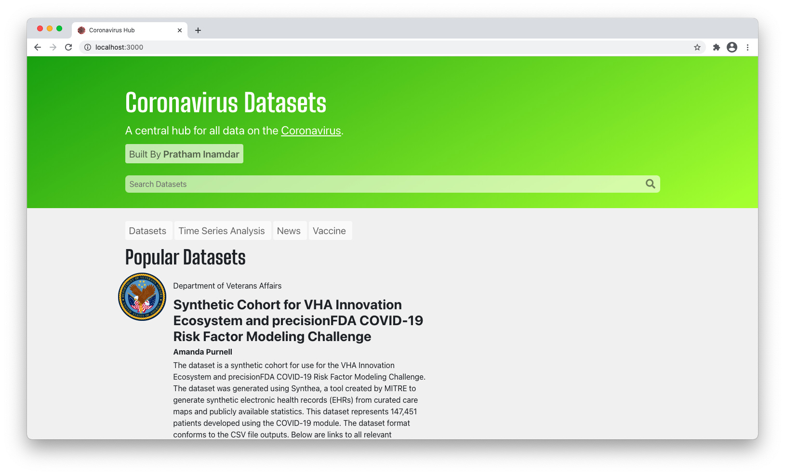

### First Division
The first division includes relevant datasets pertaining to the Coronavirus. Each dataset "cell" includes the title of the dataset, the author, the organization responsible for publishing, the date it was published, and a brief description of the dataset. It also provides a download link to the dataset, useful if one wants to take a look at the data itself. The data and metadata is provided by [data.gov](https://data.gov).

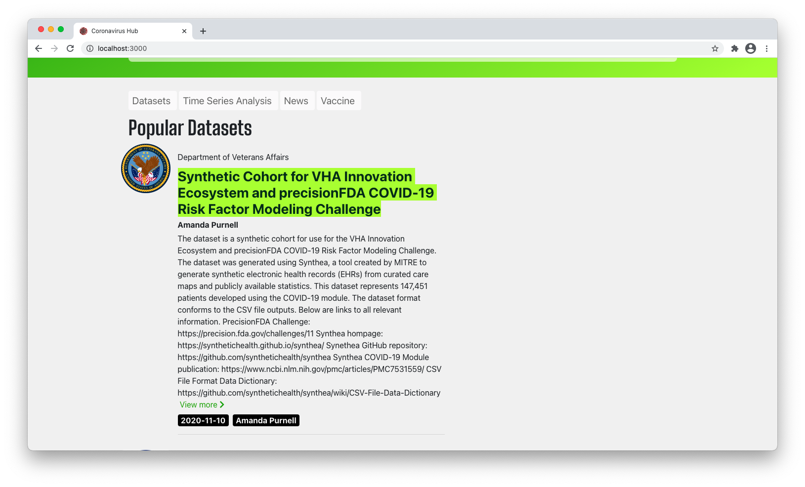

### Second Division
The second division contains informational statistics regarding the Coronavirus. It also contains a time series analysis in the form of a graph, and fetches data from [The Covid Tracking Project](https://covidtracking.com).

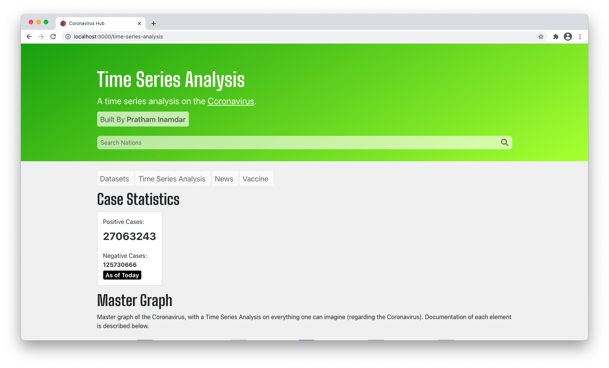

The time series analysis is represented in the form of a graph, with the points plotted being fetched from [The Covid Tracking Project](https://covidtracking.com). Below is an image of the graph with all of the different parameters, represented in a single graph.

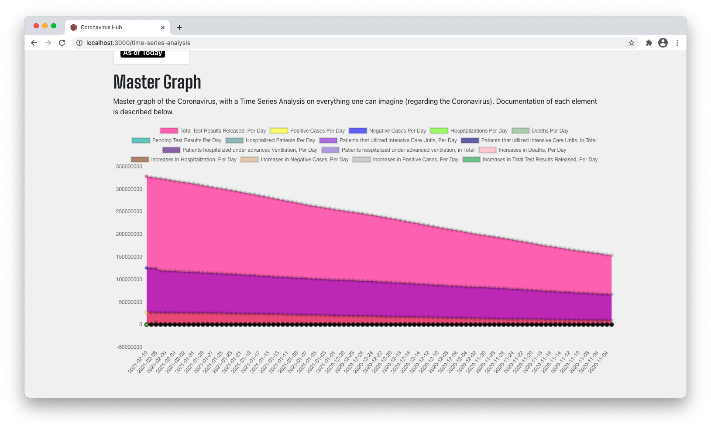

The image below represents the dynamic nature of the graph, with adjustable parameters to meet the user's needs. If the user does not need to view a paticular parameter, they can simply cross it out and the graph and axes adjust automatically, all with a smooth animation.

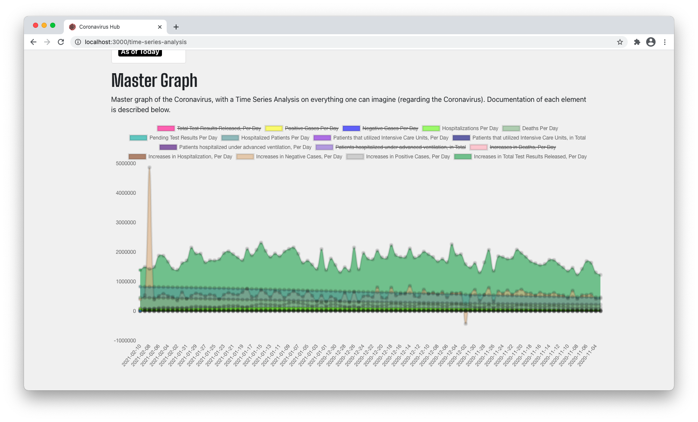

Below is an image of the footer, with the date the data was last updated, directly pulled from the [The Covid Tracking Project](https://covidtracking.com) API.

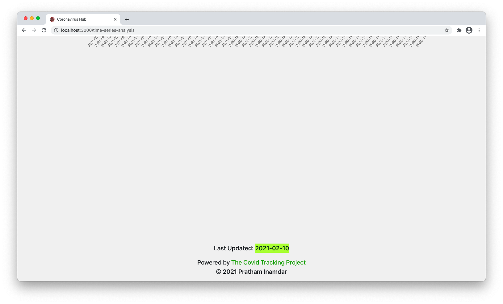

### Third Division
The third division contains news regarding the Coronavirus. Each news "cell" contains the title of the article, the author, the publication, the date published, an image of the cover picture, and a brief description of the dataset. It also provides a link to the article for future viewing or learning more. The data and metadata is provided by [newsapi.org](https://newsapi.org).

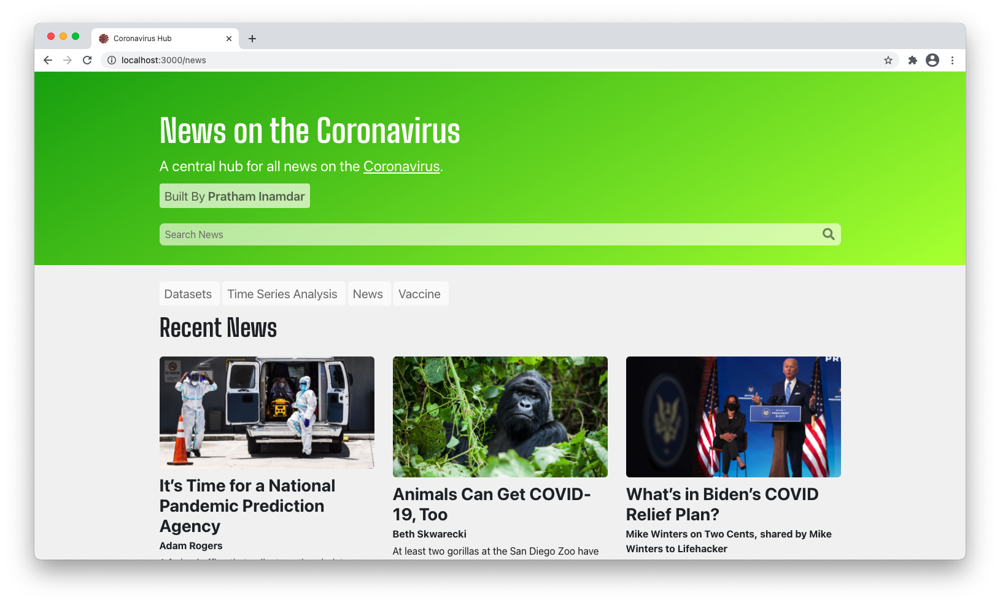
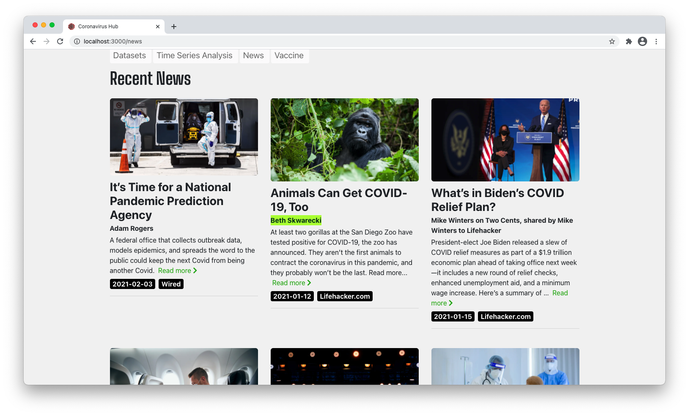

### Fourth Division
The fourth division contains relevant vaccine information including distribution, from [cdc.gov](https://cdc.gov). 

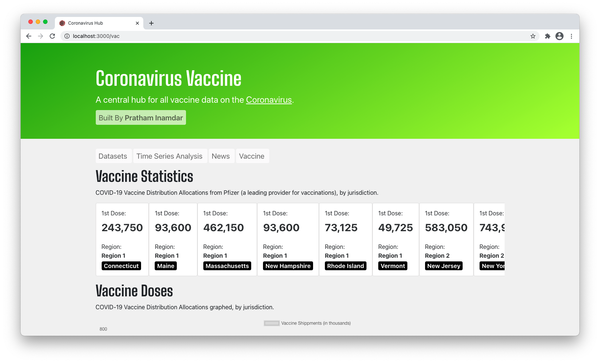

This division contains vaccine dosage shipments and administrations per each juristriction, all in the form of a scrollable div. It also groups them by region, for easier access to the end user.

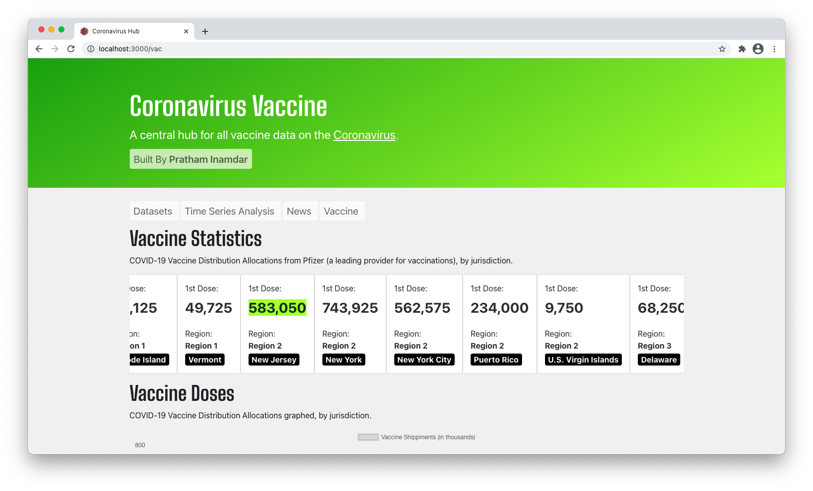

This division also contains a bar graph of the data above it (vaccine dosage shipments and administrations by juristriction), which helps the user view the data relative to itself, in a much easier to view format. 

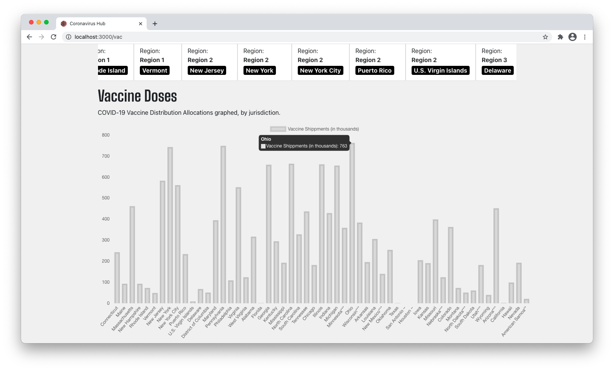

## Dependencies Utilized
- [React (JS + JSX)](https://reactjs.org)
- [Flask (Python module)](https://flask.palletsprojects.com/en/1.1.x/)
- [Python](https://www.python.org)
- [Axios (for graph REST API calls)](https://www.npmjs.com/package/axios)
- [Data.gov CKAN API](https://data.gov)
- [Newsapi.org API](https://newsapi.org)
- [The Covid Tracking Project API](https://covidtracking.com)
- [Cdc.gov API](https://cdc.gov)
- [Chart.js (for visualizations)](https://www.chartjs.org)
